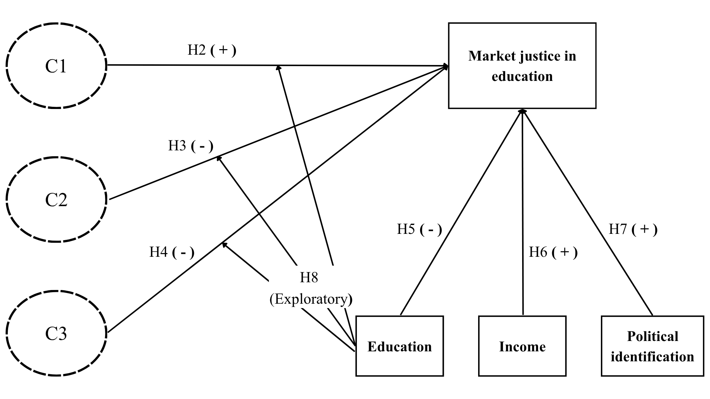








```{r}
#| label: fig-h2
#| fig-cap: Conceptual map for hypotheses.
#| fig-cap-location: bottom
#| echo: false


```

## This study

Considering the hypotheses, this study argues that implementing a private social services architecture has consequences for the population’s normative judgments, with meritocracy emerging as a driving force shaping people’s conceptions of justice in the educational sphere. Specifically, this research posits that meritocracy is a multidimensional concept, and based on this premise, it advances two main arguments: (1) Meritocratic beliefs are not subject to a rational or continuous logic; their multidimensional nature explains why such beliefs are organized into diverse patterns in people’s minds. (2) Based on these different configurations of beliefs, meritocracy can be understood as a multidirectional mechanism for legitimizing inequalities based on ability to pay, thereby expanding the current framework of understanding regarding this issue. The aim is to highlight the importance of studying the link between education and meritocracy in a global context of commodification, where this relationship addresses the convergence of familial, cultural, and academic elements in shaping a sense of justice. In a broader sense, this research could inform policymakers' prioritization of public policies that promote educational justice.

In light of the foregoing, it is worth analyzing this phenomenon in Chile, a country that offers an interesting case for examining how public attitudes toward the distribution of social services. Chile is one of the most unequal countries in the OECD, with a high concentration of income and wealth in the top decile [@chancel_world_2026; @flores_top_2020]. This inequality is largely attributable to the neoliberal reforms of the civil-military dictatorship (1973–1989), subsequently expanded by democratic governments, which privatized and commodified key spheres of social reproduction through concessions and regulatory frameworks favorable to private provision [@madariaga_three_2020; @pnud_desiguales_2017]. This model has produced structurally segmented systems in health care, education, and pensions, where access and quality depend on the ability to pay, benefiting higher-income sectors and relegating the poorest to limited, underfunded public alternatives [@castillo_perceptions_2025; @boccardo_30_2020]. The education system is characterized as one of the most privatized in the world, where the quality of private education surpasses that of public education due to the limited regulation of the education market, and where high levels of private-sector investment coexist with a lack of public funding, which is reflected in high levels of school segregation and a low regard for public education [@ramos_educacion_2022; @bellei_problema_2025; @valenzuela_socioeconomic_2014]. Thus, in a context marked by high and durable inequalities, deep marketization of education, and the entrenchment of meritocratic beliefs, it becomes relevant to examine the link between meritocratic beliefs and preferences for education market justice [@castillo_perceptions_2025].
