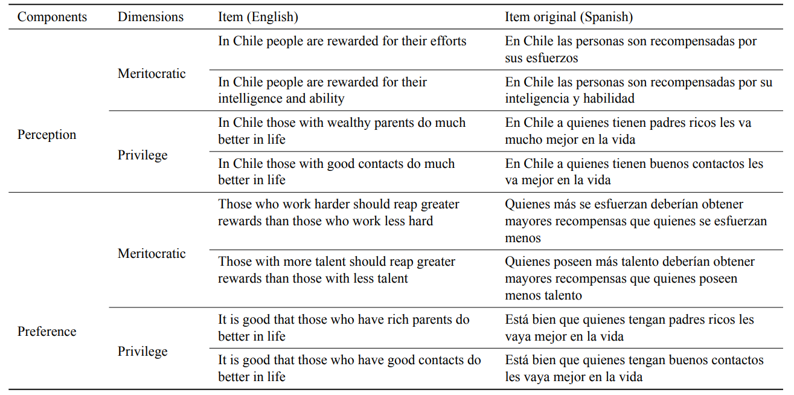
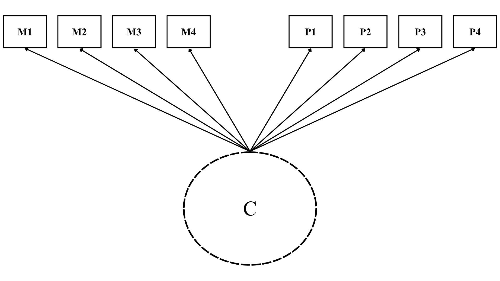
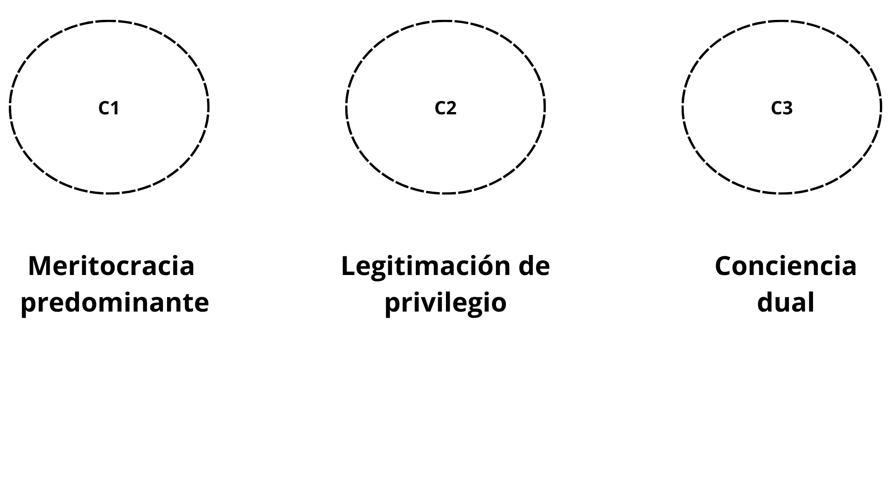
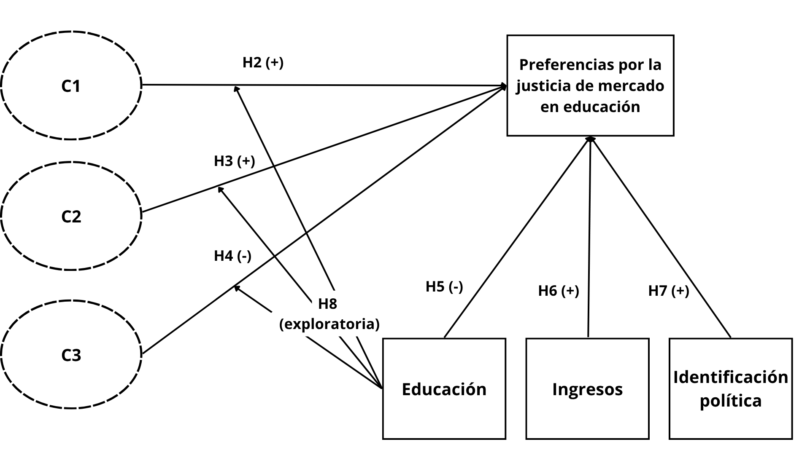

:::: columns

::: {.column width="30%"}

:::

::: {.column .column-right width="70%"}

# Preferencias de mercado en la educación

 El rol de las creencias meritocráticas en el contexto chileno {style="font-size:25px; text-align:right; line-height:1.1; margin-top:10px;"}
------------------------------------------------------------------------ 
------------------------------------------------------------------------ 
 

**Tomás Urzúa Moreno**

### *Coloquio de tesistas, Magíster Ciencias Sociales - UCH*   14 agosto 2026

:::

::::

# Contexto y antecedentes {background-color="#303029"}

## Desigualdades en educación

:::{.incremental .highlight-last style="font-size: 110%"}

- La educación ha sido un pilar fundamental en el funcionamiento de las sociedades al ser **propulsora** de la igualdad de oportunidades y la movilidad social

- Sin embargo, existen desigualdades importantes en el ámbito educativo, donde gran parte de ellas se han relacionado a los **procesos de comodificación** que ha protagonizado la educación los últimos años [@ball_education_2004; @castles_oxford_2010; @waslander_markets_2010; @busemeyer_education_2013].

- La desigualdad en educación puede observarse en distintos grados dependiendo el contexto, pero en **Chile** es especialmente alta [@castles_oxford_2010; @boccardo_30_2020; @valenzuela_socioeconomic_2014; @bellei_problema_2025]
  
  - La educación chilena opera bajo lógicas de mercado, donde su acceso y calidad está **determinado por el dinero** [@corvalan_mercado_2016; @valenzuela_socioeconomic_2014; @ramos_educacion_2022; @bellei_gran_2016], 
:::

## Educación y mercado

:::{.incremental .highlight-last style="font-size: 110%"}

- Existen distintas agendas que se han dedicado a estudiar las desigualdades en educación, desde la infraestructura o la calidad docente [@ramos_educacion_2022; @bellei_problema_2025; @corvalan_mercado_2016; @contreras_private_2024]. Ahora bien, también hay una vertiente que se ha dedicado a estudiar las **actitudes respecto a la desigualdad** en educación [@busemeyer_education_2013; @busemeyer_investing_2018; @castillo_changes_2025]. 

- **El problema**: a pesar de la demanda por equidad, o mayor inversión pública en educación, existe parte de la población que **legitima la desigualdad en educación**. 

- Concepto central: **justicia de mercado en educación**

  - Creencias normativas que **legitiman** la idea de que el acceso a los servicios sociales esenciales -como la educación- debe determinarse según **criterios basados en el mercado** [@lane_market_1986]
:::

:::{.notes}

La justicia de mercado se comprende como parte de la justicia distributiva, pero enfocada en la justificación de desigualdades mediante mecanismos de mercado más que en el apoyo a la redistribución.

- Esto genera una serie de interrogantes como: 

  - ¿por qué se estaría dispuesto a apoyar la desigualdad en este ámbito?
  - ¿qué caracteriza a estas personas?
:::

## Meritocracia      

:::{.incremental .highlight-last style="font-size: 120%"}
- Michael Young [1953][-@young_rise_2017]: Mérito = esfuerzo + talento

- Agenda de investigación se divide en dos líneas principales: meritocracia como **factor asociado** a fenómenos sociales (1) y **medición** de meritocracia (2)

- Principales hallazgos: 

  - (1) Relación entre la meritocracia y la legitimación de desigualdades. [@mijs_paradox_2021; @heuer_legitimizing_2020; @clycq_meritocracy_2014; @morris_paradox_2022; @castillo_justification_2026]

  - (2) La meritocracia **no es unidimensional** ni sigue una lógica continua -> **meritocracia multidimensional** [@castillo_multidimensional_2023; @zhu_meritocratic_2025]
:::

:::{.notes}
la meritocracia opera como un factor clave en la comprensión de la justicia de mercado en educación. 
:::

##

## Creencias meritocráticas

:::{.incremental .highlight-last style="font-size: 130%"}
- Las creencias pueden parecer contradictorias, pero pueden **coexistir** dentro de los sistemas de creencias de las personas

- Sin embargo, a primera vista no es posible determinar en qué medida **varían** las creencias meritocráticas de las personas, y cómo representan a la sociedad en términos de **cantidad y tamaño** [@zhu_meritocratic_2025]

- Para ello, recurriremos a **Análisis de Clases Latentes (LCA)**, un método que permite observar la **heterogeneidad de creencias** en la población mediante la clasificación de subgrupos
:::

# Preguntas de investigación {background-color="#303029"}

## {background-color="#303029"}

::: {.box-inv-5 .fragment .sp-after style="font-size: 130%;"}
¿Cómo se manifiestan los patrones de creencias meritocráticas en cuanto al número de grupos identificables y su tamaño?
:::

 

 

::: {.box-inv-5 .fragment .sp-after style="font-size: 130%;"}
¿En qué medida influyen los patrones de creencias meritocráticas en las preferencias por la justicia de mercado en educación?
:::

## Esta investigación

:::{.incremental .highlight-last style="font-size: 100%"}
- Contribuir en la línea de investigación sobre justicia de mercado y meritocracia [@castillo_socialization_2024; @castillo_perceptions_2025; @castillo_justification_2026; @lindh_public_2015] a partir de dos innovaciones:

  - Explorar patrones de creencias meritocráticas en la población chilena mediante métodos centrados en las personas

  - Analizar la relación entre preferencias por justicia de mercado en educación y los distintos grupos de personas definidos por sus patrones de creencias

- Así, esta investigación: 

  - A partir de las diferentes relaciones entre las clases y la preferencia por justicia de mercado en educación, pretende demostrar que la **meritocracia opera de manera distinta** como mecanismo para la justificación de las desigualdades, y estas diferencias solamente son notables al observar la **heterogeneidad de creencias** de las personas
:::

## 

##

## Hipótesis

# Métodos {background-color="#303029"}

## Datos

:::{.incremental .highlight-last style="font-size: 140%"}
- Encuesta *Educación, Meritocracia y Cohesión Social* realizada por el FONDECYT N°1210847 en el año 2025

- N total = 3470

- Aplicada mediante CAWI (Computer-Assisted Web Interviewing)

- Diseño muestral no probabilístico; cuotas de edad, sexo y nivel educacional
:::

## Variable dependiente

:::{.incremental .highlight-last style="font-size: 130%"}
- Preferencias por la justicia de mercado en educación: **_¿Es justo que las personas de altos ingresos tengan una mejor educación para sus hijos que las personas con ingresos más bajos?_**

 

- Escala likert: Muy en desacuerdo (1) a Muy de acuerdo (5)
:::

## Estrategia analítica

### 3 pasos

:::{.incremental .highlight-last style="font-size: 120%"}
- Análisis de clases latentes para identificar patrones de creencias meritocráticas, y luego asignar a cada individuo a un grupo (clase latente) [@scottorosato_latent_2012; @zhu_meritocratic_2025]

- Luego, los grupos observados son considerados como **variables independientes** en un modelo de regresión logística, con el objetivo de **examinar** la relación entre cada grupo con la preferencia por justicia de mercado en educación

- Replicación del análisis utilizando datos de población estudiantil a modo de análisis de robustez
:::

## Referencias

